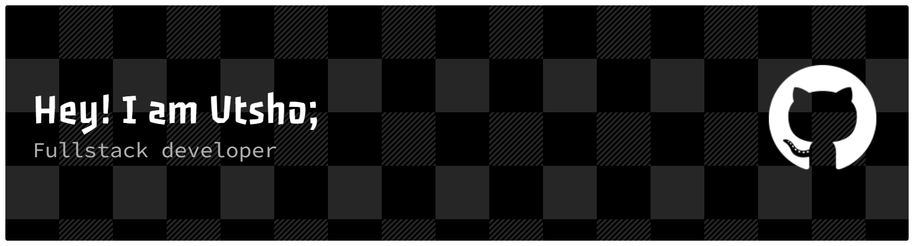

# 

## 💫 About Me

- 🔥 I am deeply passionate about web development — from crafting clean UI to building scalable backend systems, I love turning ideas into smooth, functional digital experiences.
- 🔭 Currently building ZapShift
- 👯 Open to collaborating on MERN Stack projects
- 🌱 Learning Golang
- 📍 Based in Dhaka, Bangladesh
- 🕒 Timezone: GMT+6 (BST)

---

## 🌐 Socials

---

## 🗂️ My Other GitHub Spaces

I keep different projects in different corners of GitHub—because organization is underrated and chaos is overrated.

- **Web Development Playground**  
  👉 https://github.com/mahadyhassanutsho  

- **Interpreters & Compilers Experiments**  
  👉 https://github.com/utshowmh  

---

## 💻 Tech Stack

### **Frontend**

### **Backend**

### **Languages & Scripting**

### **Package Managers & Dev Tools**

### **Deployment / Hosting**

### **Design**

---

## 📊 GitHub Stats

  
  

---

### ✍️ Random Dev Quote

### 🔝 Top Contributed Repositories

---

<!-- Proudly created with GPRM ( https://gprm.itsvg.in ) -->
