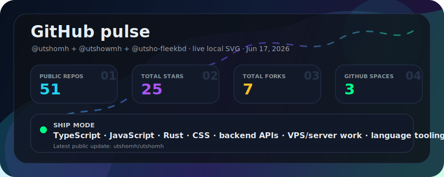
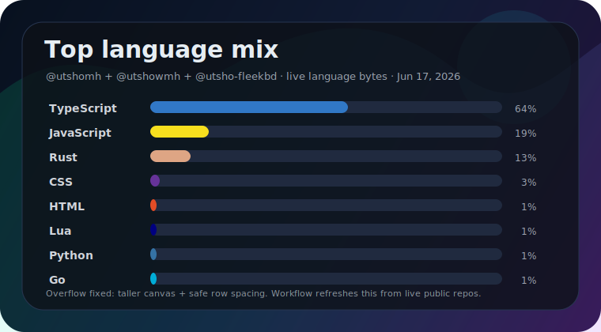
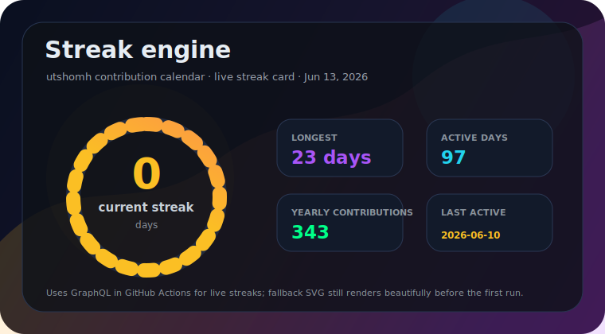

<!--
  GitHub Profile README for: utshomh
  The analytics cards are local SVG files generated by scripts/update_profile_cards.mjs.
  This avoids fragile third-party stats cards and gives you custom animated visuals.
-->

<p align="center">
  
</p>

<p align="center">
  <a href="https://git.io/typing-svg">
    
  </a>
</p>

<p align="center">
  <a href="mailto:utshomh.dev@gmail.com"></a>
  <a href="https://linkedin.com/in/utshomh"></a>
  <a href="https://github.com/utshomh"></a>
  <a href="https://utshomh.vercel.app"></a>
  
</p>

---

## 🧭 About me

```ts
const utsho = {
  location: "Dhaka, Bangladesh 🇧🇩",
  timezone: "GMT+6 / BST",
  role: "Full-stack developer with a backend obsession",
  currentQuest: "Learning Rust and building systems from scratch",
  backendToolkit: [
    "NestJS", "Express", "ElysiaJS", "Bun", "Node.js", "Go', "PostgreSQL",
    "MongoDB", "Drizzle", "Prisma", "Docker", "OpenAPI/Swagger", "Postman"
  ],
  frontendToolkit: ["React", "Next.js", "TanStack Start", "TypeScript", "Tailwind", "DaisyUI"],
  opsSetup: ["Linux", "Arch", "Neovim", "VPS deploys", "server setup", "Vercel"],
  systemsSideQuests: ["Rust", "Go", "tiny databases", "shells", "interpreters", "parser combinators"],
  openTo: ["collaboration", "backend projects", "full-stack apps", "open source experiments"],
  motto: "Make it useful. Make it fast. Make it a little delightful.",
};
```

<table>
  <tr>
    <td width="50%">
      <h3>🛠️ What I build</h3>
      <p>Full-stack products with polished interfaces, auth flows, dashboards, marketplaces, APIs, database schemas, deployment-ready backends, and VPS/server work.</p>
    </td>
    <td width="50%">
      <h3>🧪 What I explore</h3>
      <p>Rust, Go, tiny databases, scripting languages, parser combinators, shell/server experiments, and anything that reveals how computers really work.</p>
    </td>
  </tr>
</table>

---

## 🚀 Featured quests

| # | Project | Vibe | Stack / Focus |
|---:|---|---|---|
| 1 | [`LocalChefBazaar Client`](https://github.com/utshomh/LocalChefBazaarClient) + [`Server`](https://github.com/utshomh/LocalChefBazaarServer) | 🍲 Marketplace for local home-cooked meals | React, Node.js, Express, Firebase/MERN-style app |
| 2 | [`Krishilink Client`](https://github.com/utshomh/krishilink-client) + [`Server`](https://github.com/utshomh/krishilink-server) | 🌾 Farmer + buyer agro-trade platform | React, Tailwind, Firebase, Node, Express, MongoDB |
| 3 | [`CareIO`](https://github.com/utshomh/care-io) | 🫶 Babysitting & elderly-care service platform | TypeScript, Next.js, PostgreSQL, Prisma, NextAuth |
| 4 | [`rusql`](https://github.com/utshomh/rusql) | 🦀 Minimal SQL database | Rust, database internals, systems learning |
| 5 | [`utshowmh/crab`](https://github.com/utshowmh/crab) | 🦀 Statically typed scripting language | Rust, language design, interpreters |
| 6 | [`utshowmh/yascl`](https://github.com/utshowmh/yascl) + [`func`](https://github.com/utshowmh/func) + [`stuck`](https://github.com/utshowmh/stuck) | 🧙 Language-lab rabbit hole | Scripting languages, stack machines, Rust experiments |
| 7 | [`utsho-fleekbd/onecomm-api`](https://github.com/utsho-fleekbd/onecomm-api) | 🔌 API/backend demo | NestJS-style backend structure, Prisma, TypeScript |

---

## 🧰 Tech toolbox

<p align="center">
  
</p>

<p align="center">
  
  
  
  
  
  
  
  
  
  
  
  
  
  
  
  
  
  
  
  
  
  
  
  
  
  
</p>

---

## 🧩 My GitHub multiverse

| Space | What lives there |
|---|---|
| [`@utshomh`](https://github.com/utshomh) | Main profile, full-stack apps, backend APIs, TypeScript projects, Rust/system experiments, portfolio work |
| [`@utshowmh`](https://github.com/utshowmh) | Rust interpreters, scripting languages, parser/combinator experiments, compiler rabbit holes |
| [`@utsho-fleekbd`](https://github.com/utsho-fleekbd) | Backend/API work, TypeScript services, commerce/demo projects |
| [`@mahadyhassanutsho`](https://github.com/mahadyhassanutsho) | Web-dev playground, practice projects, fun UI experiments |

---

## 📊 GitHub analytics

<p align="center">
  
</p>

<p align="center">
  
  
</p>

<!--
  Refresh local animated cards manually with:
  PROFILE_USERNAME=utshomh EXTRA_GITHUB_USERS=utshowmh,utsho-fleekbd node scripts/update_profile_cards.mjs

  Or keep the included GitHub Action enabled to refresh them automatically.
-->

---

## 🧪 Current side quests

- 🦀 Building Rust projects to understand systems from the metal upward.
- ⚙️ Practicing backend architecture with NestJS, ElysiaJS, Bun, Docker, PostgreSQL, Drizzle/Prisma, auth, OpenAPI/Swagger, Postman, and clean API design.
- 🐧 Daily-driving an Arch + Neovim workflow, with Linux/VPS deployment and server setup work.
- 🎨 Polishing UI/UX with small details that make apps feel alive.
- 🤝 Open to collaboration on web apps, backend services, dev tools, and quirky open-source experiments.

---

<p align="center">
  
</p>
